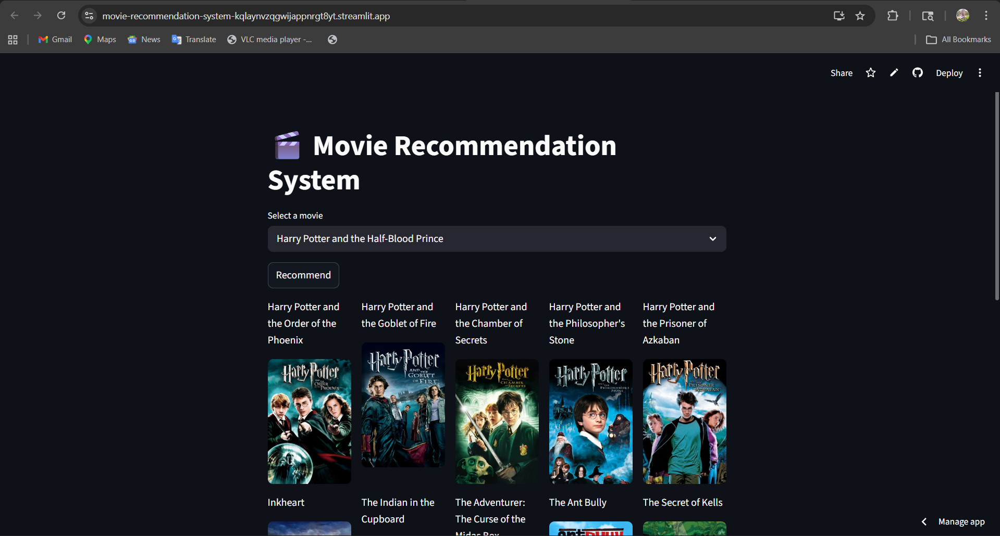
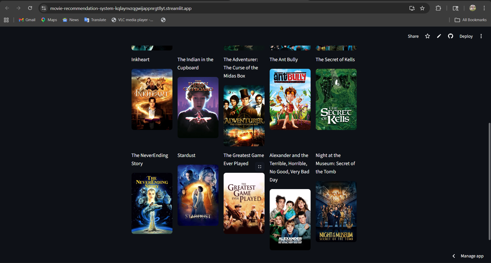

# 🎬 Movie Recommendation System

A content-based Movie Recommendation System built using Python, Machine Learning, Streamlit, Scikit-learn, and TMDB API.

## Features

- Recommends 15 similar movies
- Displays movie posters using TMDB API
- Content-based filtering
- Interactive Streamlit UI
- Fast recommendation system using cosine similarity

## Tech Stack

- Python
- Pandas
- NumPy
- Scikit-learn
- Streamlit
- Requests
- Pickle

## Project Structure

```bash
movie-recommendation-system/
│
├── Screenshot/
│   ├── Screenshot.png
│   └── Screenshot2.png
│
├── app.py
├── create_similarity.py
├── movie_list.pkl
├── tmdb_5000_movies.csv
├── tmdb_5000_credits.csv
├── requirements.txt
├── README.md
└── .gitignore
```

## Screenshots

### Home Page



### Recommendation Page



## Installation

Clone the repository:

```bash
git clone https://github.com/harshsaini0106/movie-recommendation-system.git
```

Move into project folder:

```bash
cd movie-recommendation-system
```

Install dependencies:

```bash
pip install -r requirements.txt
```

Run application:

```bash
streamlit run app.py
```

## Dataset

- TMDB 5000 Movies Dataset
- TMDB 5000 Credits Dataset

## Machine Learning Workflow

1. Load movie datasets
2. Merge movie and credits data
3. Extract:
   - Genres
   - Keywords
   - Cast
   - Crew
   - Overview
4. Create tags column
5. Apply CountVectorizer
6. Calculate Cosine Similarity
7. Recommend most similar movies

## Recommendation Logic

```python
from sklearn.metrics.pairwise import cosine_similarity

similarity = cosine_similarity(vectors)
```

Movies with highest similarity scores are recommended.

## Future Improvements

- Hybrid recommendation system
- User authentication
- Genre filtering
- Movie ratings integration
- Deep learning recommendations

## Author

Harsh Saini

### Skills

- Machine Learning
- Deep Learning
- NLP
- Generative AI
- Python
- SQL
- Scikit-learn
- TensorFlow
- PyTorch
- Streamlit

GitHub:
https://github.com/harshsaini0106

## Support

Give this repository a ⭐ if you found it useful.
